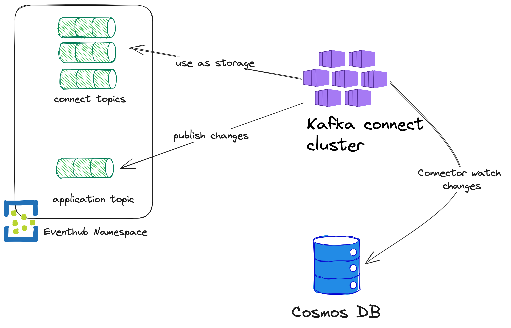

# Kafka Connect POC
The poc is intended to deploy k8s cluster an instance of kafka connect.
Actually, the main target of kafka connect is a cosmos mongodb api instance using the official mongo kafka connect at 1.5.1 version.

## Introduction
Kafka Connect is a tool for streaming data between kafka and other systems. It relies entirely on kafka, ensuring high scalability and reliability. The most important concept is that of a connector, which is responsible for managing active streaming tasks. Connectors allow interfacing to different systems such as databases (e.g. postegres, mongodb), queues, caches, full-text search engine (e.g. elastic). There are 2 types of connectors:

- source: source connector from which to read data to be ingested into kafka
- sink: connector to deliver data from kafka to an external system

There are several connectors for mongo:

- mongodb connector: officially provided by mongo
- debezium mongodb connector: made by debezium, an open source product that has a number of different connectors for kafka, transformers and more. [Debezium connector for MongoDB](https://debezium.io/documentation/reference/stable/connectors/mongodb.html)

Also, kafka connect exposes REST APIs for connector creation and state monitoring. [Here](https://developer.confluent.io/courses/kafka-connect/rest-api/#inspect-task-details) are reported the most commonly used APIs.

## Use cases
CDC can be used in a lot of applications:

- ETL pipelines
- Data propagation/replication/migration
- Event sourcing
- Reliable microservice message exchange
- Cache invalidation
- Update search index (like Elastic)
- Audit log

!!! info
    In this POC we focus on event propagation as a kind of outbox table.

## Project folders
* `kafka-connect-image` - Contains a Dockerfile to build a kafka-connect base image with official mongo db connector. It use Gradle to download dependecies from maven, also add opentelemetry java agent to jar in order to use it to instrument the connector.
